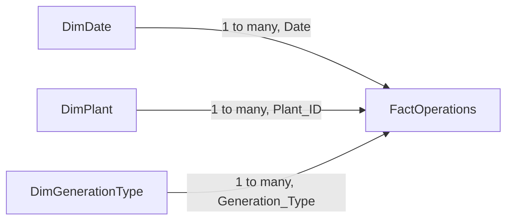

# Power BI dashboard plan

This is the build guide for the portfolio dashboard. Power BI Desktop runs on Windows, so the model is prepared here as CSV files and assembled in Desktop later. The Python project does not require Power BI.

The page answers one question:

**How effectively are our generation assets performing, and where should operations teams focus their attention?**

Build one report page named **Fleet performance**. With eight plants and one year of days, a single page can hold the scoreboard and the plants that need follow-up.

## Files to import

Run `python scripts/build_star_schema.py` first. In Power BI Desktop, use **Get data > Text/CSV** and load the four files in `data/processed/model/`:

| File | Rows | Role |
| --- | --- | --- |
| `FactOperations.csv` | 2,920 | One row per plant per day. Energy, downtime, cost, events, incidents. |
| `DimPlant.csv` | 8 | Plant name, region, nameplate MW, technology. |
| `DimDate.csv` | 365 | One row per day in 2025, with month and weekday labels. |
| `DimGenerationType.csv` | 4 | Technology names and a sort order. |

After import, set `Date` on both `FactOperations` and `DimDate` to the **Date** data type, not Date/Time. Set `Maintenance_Cost` to a decimal number and `Capacity_MW` to a whole number.

`Generation_Imputed` and `Maintenance_Cost_Corrected` are 1/0 flags. A value of 1 means the cleaner filled or repaired that field. Leave them on the fact table.

## Why a star schema

The clean extract is one wide table. Plant name, region, and capacity repeat on all 365 rows for that plant. That file is a good extract. It is a weak model, because a capacity total would add the same megawatts once per day.

A star schema separates two kinds of information:

- **Dimensions** describe things: a plant, a day, a technology. Each appears once.
- **Facts** record what happened: megawatt-hours, downtime hours, dollars. These are safe to sum.

Filters sit on the dimensions. Power BI uses the relationships to keep the matching fact rows. A slicer set to Coastal Plain keeps Harbor Storage, Cedar Bend, and Gale Point, and every visual then sums only those plants' fact rows.



## Relationships

Create these three relationships in **Model view**. Each is one-to-many, with the filter direction running from the dimension to the fact. Leave cross-filter direction on **Single**.

| From | To | Columns | Cardinality |
| --- | --- | --- | --- |
| `DimDate` | `FactOperations` | `Date` to `Date` | One to many |
| `DimPlant` | `FactOperations` | `Plant_ID` to `Plant_ID` | One to many |
| `DimGenerationType` | `FactOperations` | `Generation_Type` to `Generation_Type` | One to many |

`Generation_Type` also sits on `DimPlant`, so a plant table can show the technology next to the plant name. Do not draw a relationship from `DimGenerationType` to `DimPlant`. Two paths into the same column make the filter logic ambiguous. The technology slicer filters the fact. The plant slicer filters the fact. Both can be used together.

Then:

1. Select `DimDate` and choose **Mark as date table**, using the `Date` column.
2. Sort `Month_Name` by `Month`. Otherwise the month axis runs April, August, December, because Power BI sorts names alphabetically.
3. Sort `Month_Year_Label` by `Year_Month`.
4. Sort `Day_Name` by `Weekday_Number`.
5. Sort `DimGenerationType[Generation_Type]` by `Sort_Order`, so charts follow gas, wind, solar, then storage.
6. In the fact table, hide `Plant_ID`, `Generation_Type`, and `Date` from report view. Visuals should use the dimension columns, so slicers and labels stay on one copy of each name.

## Measures, not averaged columns

The fact table intentionally omits capacity factor, availability percent, and variance percent. Those are ratios. Averaging a ratio column gives every plant-day the same weight, so a 50 MW battery counts as much as a 540 MW combined-cycle unit. The Python KPIs use a ratio of sums. The DAX measures below do the same thing, and they respond to slicers.

Create the measures on `FactOperations`. Use **Home > New measure**. Format each one before building visuals.

`RELATED` looks up the plant's nameplate from `DimPlant` through the `Plant_ID` relationship.

### Required measures

```dax
Total Generation =
SUM ( FactOperations[Actual_Generation_MWh] )
```

Format: `#,0 "MWh"`. For battery rows, actual MWh is energy discharged, so this card includes storage. A technology slicer removes it when storage is not selected.

```dax
Total Capacity =
SUMX (
    SUMMARIZE (
        FactOperations,
        DimPlant[Plant_ID],
        DimPlant[Capacity_MW]
    ),
    DimPlant[Capacity_MW]
)
```

Format: `#,0 "MW"`. `SUMMARIZE` returns each plant once inside the current filters, then adds nameplate MW. A plain `SUM ( DimPlant[Capacity_MW] )` ignores the technology slicer, because that slicer filters the fact, not `DimPlant`. Summing capacity off the fact rows would also multiply each plant by the number of days in the filter.

```dax
Average Availability =
DIVIDE (
    SUMX (
        FactOperations,
        RELATED ( DimPlant[Capacity_MW] ) * FactOperations[Available_Hours]
    ),
    SUMX (
        FactOperations,
        RELATED ( DimPlant[Capacity_MW] ) * 24
    )
)
```

Format: `0.0%`. This is online megawatt-hours divided by possible megawatt-hours. On the full year it returns **97.5%**, matching `kpi_fleet.csv`.

```dax
Total Maintenance Cost =
SUM ( FactOperations[Maintenance_Cost] )
```

Format: `$#,0`.

```dax
Total Unplanned Downtime =
SUM ( FactOperations[Unplanned_Downtime_Hours] )
```

Format: `#,0 "hrs"`.

```dax
Generation Variance =
SUM ( FactOperations[Actual_Generation_MWh] )
    - SUM ( FactOperations[Expected_Generation_MWh] )
```

Format: `#,0 "MWh"`. Negative means the selection finished below plan. Sum the two energy columns. Do not average the daily percent.

```dax
Generation Variance % =
DIVIDE (
    [Generation Variance],
    SUM ( FactOperations[Expected_Generation_MWh] )
)
```

Format: `0.00%`. The full-year value is **-0.19%**.

```dax
Capacity Factor =
DIVIDE (
    [Total Generation],
    SUMX (
        FactOperations,
        RELATED ( DimPlant[Capacity_MW] ) * 24
    )
)
```

Format: `0.0%`. Actual MWh divided by nameplate MW times 24 hours for every fact row in the filter. The full-year value is **42.8%**.

### Supporting measures

The top card for available capacity uses this measure. It is the average, across the selected days, of nameplate MW online that day. On the full year it returns **1,452 MW**.

```dax
Available Capacity =
AVERAGEX (
    VALUES ( DimDate[Date] ),
    CALCULATE (
        SUMX (
            FactOperations,
            RELATED ( DimPlant[Capacity_MW] ) * FactOperations[Available_Hours] / 24
        )
    )
)
```

Format: `#,0 "MW"`.

These three drive the downtime, exposure, and planned-outage visuals:

```dax
Total Planned Downtime =
SUM ( FactOperations[Planned_Downtime_Hours] )
```

```dax
Unplanned Capacity MWh =
SUMX (
    FactOperations,
    RELATED ( DimPlant[Capacity_MW] ) * FactOperations[Unplanned_Downtime_Hours]
)
```

Format: `#,0 "MWh"`. This is nameplate MW times unplanned hours. It ranks which outages take the most capacity out of the fleet. It is an exposure figure. A solar plant would not have been at full power for every one of those hours.

```dax
Total Expected Generation =
SUM ( FactOperations[Expected_Generation_MWh] )
```

## Page layout

Put the slicers where a reader sees them before the charts. The cards answer how the fleet did. The charts answer where to look.

```text
+------------------------------------------------------------------+
| Fleet performance                                                |
| Date between | Facility | Generation type | Region               |
+----------+----------+----------+----------+----------------------+
| Total    | Available| Average  | Unplanned| Maintenance          |
| Generation| Capacity| Availability| Downtime| Cost               |
+---------------------------+--------------------------------------+
| Generation by energy source| Actual vs expected, by facility     |
+------------------------------------------------------------------+
| Monthly generation trend                                         |
+---------------------------+--------------------------------------+
| Availability by facility  | Planned vs unplanned downtime        |
+---------------------------+--------------------------------------+
| Maintenance cost by facility                                     |
+------------------------------------------------------------------+
| Facility performance table                                       |
+------------------------------------------------------------------+
```

Use a light background, one accent color for actual generation, and a second color for expected generation. Keep planned downtime and unplanned downtime on two consistent colors across the page, so the downtime chart and the table mean the same thing.

## Visuals

Every visual uses measures, except the labels that come from dimensions (`Plant_Name`, `Generation_Type`, `Month_Name`, `Region`).

### KPI cards

Use the **Card** visual for each. Drop the measure on the card. There is no category axis.

| Card | Measure | Full-year check |
| --- | --- | --- |
| Total Generation | `Total Generation` | 5,592,439 MWh |
| Available Capacity | `Available Capacity` | 1,452 MW |
| Average Availability | `Average Availability` | 97.5% |
| Unplanned Downtime | `Total Unplanned Downtime` | 290 hrs |
| Maintenance Cost | `Total Maintenance Cost` | $3,023,745 |

`Total Capacity` (1,490 MW) belongs in a tooltip on the Available Capacity card, or as a subtitle, so the reader can see installed nameplate next to what was actually online.

### Generation by energy source

**Clustered bar chart.**

- Axis: `DimGenerationType[Generation_Type]`
- Values: `Total Generation`
- Sort the axis by `Total Generation`, descending

A bar chart makes the four technologies easy to compare. Gas is most of the energy, then wind, then solar, then battery discharge. A donut chart shows share of the total, and with four slices it is readable, but the bar chart keeps the labels next to the values.

Turn on data labels.

### Actual vs expected generation

**Clustered column chart.**

- Axis: `DimPlant[Plant_Name]`
- Values: `Total Generation` and `Total Expected Generation`
- Sort by `Total Generation`, descending

Two columns per plant show who is carrying the fleet and who is off plan. Riverbend dominates the scale. Put `Generation Variance` and `Generation Variance %` in the tooltip so the smaller plants are still readable. The gas plants should sit almost on top of their expected columns. Red Mesa should sit above its expected column.

### Monthly generation trend

**Line chart.**

- X-axis: `DimDate[Month_Name]`, sorted by `Month`
- Y-axis: `Total Generation`
- Legend: `DimGenerationType[Generation_Type]`

One line per technology shows the operating story the annual total hides: solar rises into summer, wind is stronger in the winter months, and natural gas drops in April because Riverbend is on a planned outage. The card at the top still holds the fleet total.

If the page has room, add a second line chart under it: X-axis `Month_Name`, Y-axis `Total Generation` and `Total Expected Generation`, with no legend. That is the fleet actual-versus-plan trend. April's actual line should dip, and it should stay close to expected, because the outage was already in the plan.

### Availability by facility

**Clustered bar chart.**

- Axis: `DimPlant[Plant_Name]`
- Values: `Average Availability`
- Sort ascending, so the lowest availability is at the top

Add a constant line at 97.5% if the analytics pane is available, labeled fleet average. Riverbend and Pinecrest should sit below that line because of their planned outages. The battery plants should sit near 100%.

Set the X-axis to start around 90% rather than 0%, so the gap between 95% and 99% is visible. Say so in the axis title, so a cropped axis is not mistaken for a large failure.

### Planned vs unplanned downtime

**Clustered bar chart.**

- Axis: `DimPlant[Plant_Name]`
- Values: `Total Planned Downtime` and `Total Unplanned Downtime`
- Sort by `Total Unplanned Downtime`, descending

Sorting by unplanned hours puts the attention list at the top: Riverbend, then Cedar Bend. Planned hours explain Pinecrest's long bar and Riverbend's April outage. Unplanned hours are the forced-outage follow-up.

### Maintenance cost by facility

**Clustered bar chart.**

- Axis: `DimPlant[Plant_Name]`
- Values: `Total Maintenance Cost`
- Sort descending

Riverbend should be most of the bar length, then Pinecrest, then the two wind plants. This chart and the April dip in the trend chart are the same event seen two ways.

### Facility performance table

**Table** visual. This is the page's detail, so a plant picked from a chart can be read with the rest of its numbers.

| Column | Field |
| --- | --- |
| Plant | `DimPlant[Plant_Name]` |
| Technology | `DimPlant[Generation_Type]` |
| Region | `DimPlant[Region]` |
| Capacity MW | `Total Capacity` |
| Generation MWh | `Total Generation` |
| Capacity factor | `Capacity Factor` |
| Availability | `Average Availability` |
| Unplanned hours | `Total Unplanned Downtime` |
| Unplanned exposure MWh | `Unplanned Capacity MWh` |
| Variance | `Generation Variance %` |
| Maintenance cost | `Total Maintenance Cost` |

Sort by `Total Unplanned Downtime`, descending.

Use conditional formatting on `Generation Variance %`: a diverging scale with negative values in one color and positive values in another. Use a light background scale on `Average Availability`. Leave capacity factor uncolored. A 21% factor at Pinecrest is a peaker on plan, and a 13.7% factor at a battery is a few hours of discharge.

## Slicers

Place four slicers across the top. Each one filters every visual on the page. In **Format > Edit interactions**, the default filter behavior is what this page needs.

| Slicer | Field | Style | Why this style |
| --- | --- | --- | --- |
| Date | `DimDate[Date]` | Between | A start and end date covers a month, an outage window, or the full year. |
| Facility | `DimPlant[Plant_Name]` | Dropdown | Eight names. A dropdown stays compact. |
| Generation type | `DimGenerationType[Generation_Type]` | Tile | Four choices. Tiles are faster to read than a dropdown. |
| Region | `DimPlant[Region]` | Dropdown | Four fictional regions: High Desert, Coastal Plain, River Valley, North Ridge. |

Add a fifth slicer only when you want to inspect data quality: `FactOperations[Generation_Imputed]`, as a dropdown. Leaving it on All includes the four filled days. Selecting 0 removes them. Fleet variance stays at about 0.19% below plan either way. Use this slicer when someone asks whether the variance numbers depend on the imputed days.

Selecting **Solar** on the tile slicer should change the cards, leave two plants in the charts, and show installed capacity of 275 MW. Selecting **Riverbend Combined Cycle** should show maintenance cost near $1.87 million.

## Checks before you call the page done

With every slicer cleared, the five cards should match the table in the README and `data/processed/kpi_fleet.csv`:

- Total Generation = 5,592,439 MWh
- Available Capacity = 1,452 MW
- Average Availability = 97.5%
- Unplanned Downtime = 290 hrs
- Maintenance Cost = $3,023,745

Also confirm Capacity Factor = 42.8% and Generation Variance % = -0.19% in the table visual's total row, or on a temporary card.

Then filter the date slicer to April 2025. Generation should fall, planned downtime and maintenance cost should rise, and the drop should be concentrated on Riverbend. Clear the filter and select **Cedar Bend Solar**. Unplanned hours should be 54.

If a card is blank, the measure is probably pointing at a hidden column, or a relationship is inactive. If capacity shows a number in the hundreds of thousands, the measure is summing the daily fact instead of one row per plant.

## What the finished page should make obvious

A reader who never opens the Python report should still walk away with the same operating picture:

- The fleet finished the year essentially on plan.
- Gas produces most of the energy. Wind is next. Solar and storage are smaller, and storage is discharge.
- Capacity factor differs because the assets do different jobs.
- Riverbend's April planned outage is the cost and energy event to review.
- Riverbend's unplanned hours are the largest exposure. Cedar Bend has a lot of unplanned hours for a solar plant and is the comparison against Horizon Flats.
- Wind, especially Red Mesa, moves around its expected generation from day to day. The gas units stay close to plan.
